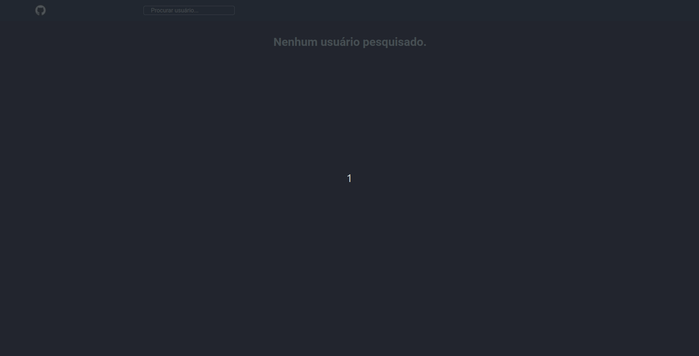

# Github API Interface

Esta é uma interface para exibição de dados obtidos por meio da [API do GitHub](https://api.github.com/), desenvolvi este projeto durante a trilha do bootcamp TQI Fullstack Developer, ao final do módulo de ReactJS, na plataforma [Digital Innovation One](https://www.dio.me/).

<h1 align="center">
  
</h1>

### 🛠 Tecnologias utilizadas:
- [ReactJS](https://pt-br.reactjs.org/);
- [Axios](https://axios-http.com/);
- [Styled Components](https://styled-components.com/);

### 📖 Como executar o projeto:

1. Execute o comando ```npm install``` em seu terminal para instalar as dependências;
2. Execute o comando ```npm run start``` em seu terminal para executar o projeto em modo de desenvolvimento.
